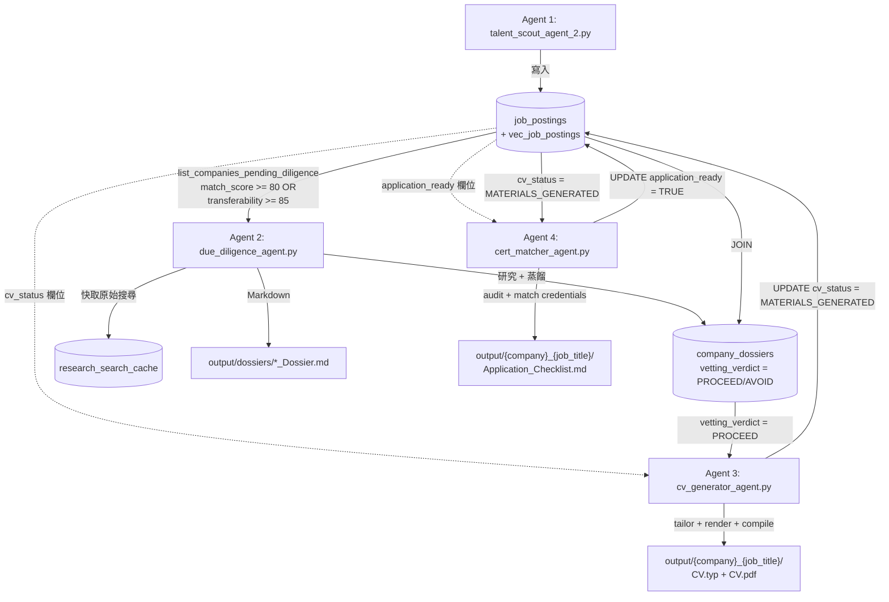

# Jobhunter — 香港 IT 獵頭多智能體管線

> 一條由四個 AI 代理組成的本地求職管線：掃描香港可信職缺來源 → 對僱主做背景調查 → 為每個高匹配職缺生成量身履歷並編譯成 PDF → 比對真實證照、審計申請入口並輸出申請清單。

`Jobhunter` 是一套專為香港 IT 市場設計的多智能體（multi-agent）自動化求職系統。它把獵頭流程拆成四個獨立可重跑的階段：**職缺探索 → 僱主背調 → 履歷生成 → 申請準備審計**，並以本地 SQLite + `sqlite-vec` 作為跨代理的共享記憶體。

本專案刻意選用 **DeepSeek**（透過 OpenAI Python SDK 呼叫 `https://api.deepseek.com`）而非直接呼叫 OpenAI，原因是 OpenAI 對香港地區回傳 403 無法使用；網路研究則使用 **Tavily** 的 Search / Extract API。

---

## 目錄

- [專案簡介](#專案簡介)
- [系統架構](#系統架構)
- [資料流程](#資料流程)
- [目錄結構](#目錄結構)
- [環境設定](#環境設定)
- [使用方式](#使用方式)
- [資料庫結構](#資料庫結構)
- [技術棧](#技術棧)
- [面試用技術棧說明](docs/INTERVIEW_TECH_STACK.md)
- [隱私與合規](#隱私與合規)
- [授權](#授權)

---

## 專案簡介

`Jobhunter` 解決一個很具體的痛點：在香港找工作時，求職者要面對 JobsDB、CTgoodjobs、各種 ATS（Workday / Greenhouse / SuccessFactors）以及大型企業自營徵才頁面，職缺散落在數十個來源，且雇主名稱常被隱藏。同時，投履歷前很難快速判斷一家公司的工程文化、技術債與近期新聞風險。

本專案用五個代理把這件事自動化：

0. **Agent 0 — 探索摘要者（`milo_intake.py`）**：匯入候選人履歷（CV 文字/PDF），透過本地 Ollama `gemma4:e2b` 聊天機器人了解職涯處境（如借調、外判等特殊情況），萃取 `ProfileAcceptanceContext`（PAC）—核心可遷移技能、探索光譜、絕對底線、候選人敘事。PAC 是**軟性引導**（非硬性過濾），用來擴展 Rex 的跨領域搜尋視野。聊天歷史完整儲存於 `milo_chat_history`。CV 與每 20 則對話會更新共享 README（`config/milo_context.md`），下游代理直接引用。
1. **Agent 1 — 職涯路徑架構師（`talent_scout_agent_2.py`）**：先把候選人主檔去識別化、把垂直領域經驗（如 ConTech / SSSS）改寫成通用工程能力，再請 DeepSeek 規劃跨產業搜尋軌道（PropTech、Critical Utilities、Logistics、FinTech），最後用 Tavily 在可信來源中搜尋、用雙分數矩陣評估、存入 SQLite + `sqlite-vec`。讀取 Milo 的 PAC 作為軟性引導來**擴展**搜尋範圍（非硬性過濾）。
2. **Agent 2 — 背景調查代理（`due_diligence_agent.py`）**：對高分職缺的雇主做 Tavily 多軌研究（新聞 / 評價 / 技術論壇）並用 `tavily.extract` 抓官方網站內容，亦可走純官方後端（Wikipedia / Wikidata / 企業官網），再由 DeepSeek 蒸餾成 `CompanyDueDiligence` 報告，輸出 `vetting_verdict`（`PROCEED` / `AVOID`）並同時寫入 SQLite 與 `output/dossiers/` 下的 Markdown。
3. **Agent 3 — 履歷生成代理（`cv_generator_agent.py`）**：只挑 `match_score >= 80` 且 `vetting_verdict = 'PROCEED'` 的職缺，請 DeepSeek 依 JD 與背調報告對候選人主檔做 ATS 對齊改寫（**僅使用主檔中的事實，禁止捏造**），用 Jinja2 渲染 Typst 模板，再由本地 Typst CLI 編譯成 PDF，最後把 `cv_status` 更新為 `MATERIALS_GENERATED`。
4. **Agent 4 — 證照比對與申請準備代理（`cert_matcher_agent.py`）**：只處理 `cv_status = 'MATERIALS_GENERATED'` 的職缺，先以確定性規則從職缺 URL 偵測申請入口（Workday / Greenhouse / JobsDB / LinkedIn / Lever / SmartRecruiters / Direct Email / Company Portal），再請 DeepSeek 比對候選人**真實證照**（AWS SAA、St. John First Aid、JLPT N3、PolyU EIE、語言能力 — 僅限主檔事實，禁止捏造）與 JD，產出 `ApplicationReadinessPack`，匯出 `output/{company}_{job_title}/Application_Checklist.md`，並把 `application_ready` 旗標寫回 `job_postings`。

整條管線的狀態都留在本地 `job_agent.db`，每個代理都可以單獨重跑、指定單一公司或單一職缺，方便反覆迭代。

---

## 系統架構

四個代理共用 `talent_scout_agent.py` 這個共享函式庫（可信來源清單、`JobDBManager`、DeepSeek 客戶端、URL / 雇主名稱解析、雙分數純函式等），並透過 SQLite 資料表傳遞狀態。

```mermaid
flowchart LR
    subgraph Shared["Shared library: talent_scout_agent.py"]
        S1[Trusted sources<br/>HK_JOB_BOARDS / ATS / Employer sites]
        S2[JobDBManager<br/>SQLite + sqlite-vec]
        S3[DeepSeek client<br/>via OpenAI SDK]
        S4[URL / employer resolution<br/>JSON-LD + snippet fallback]
        S5[Dual-score pure functions<br/>compute_composite_match_score]
    end

    subgraph A1["Agent 1: talent_scout_agent_2.py"]
        A1a[AnonymizedProfile<br/>PII redaction + de-verticalization]
        A1b[DeepSeek horizon expansion<br/>3-4 search tracks]
        A1c[Tavily lane search]
        A1d[Dual-score evaluation<br/>hard + transfer -> composite]
        A1e[(job_postings + vec_job_postings)]
    end

    subgraph A2["Agent 2: due_diligence_agent.py"]
        A2a[Tavily lanes<br/>news / sentiment / tech + tavily.extract]
        A2b[Official backend<br/>Wikipedia / Wikidata / company sites]
        A2c[DeepSeek distillation<br/>CompanyDueDiligence]
        A2d[JSON repair]
        A2e[(company_dossiers + research_search_cache)]
        A2f[Markdown export<br/>output/dossiers/*.md]
    end

    subgraph A3["Agent 3: cv_generator_agent.py"]
        A3a[Gate: match_score >= 80<br/>AND vetting_verdict = PROCEED]
        A3b[DeepSeek CV tailoring<br/>ground-truth only]
        A3c[Jinja2 -> Typst template]
        A3d[Local Typst CLI -> PDF]
        A3e[(cv_status = MATERIALS_GENERATED)]
    end

    subgraph A4["Agent 4: cert_matcher_agent.py"]
        A4a[Gate: match_score >= 80<br/>AND cv_status = MATERIALS_GENERATED]
        A4b[Deterministic channel detection<br/>Workday / Greenhouse / JobsDB / LinkedIn]
        A4c[DeepSeek credential match<br/>ground-truth only]
        A4d[ApplicationReadinessPack<br/>Pydantic v2 + json_repair]
        A4e[Markdown export<br/>output/{company}_{job_title}/Application_Checklist.md]
        A4f[(application_ready = TRUE)]
    end

    A1 --> A2 --> A3 --> A4
```

### Agent 0 — 探索摘要者（`milo_intake.py`）

Agent 0 是管線最前端的「視角提供者」，不做硬性過濾：

- **CV 匯入**：接受文字或 PDF 履歷，用本地 Ollama `gemma4:e2b` 解析為結構化設定檔（basics、education、technical_skills、experience、projects、certifications）。
- **聊天機器人**：使用者可透過聊天補充職涯處境（如「我名義上在健身科技公司，但實際在 ConTech 公司做 4S 遙測平台」）。Ollama 萃取新事實並更新設定檔。
- **語境壓縮 → 共享 README**：匯入 CV 後立刻寫入 `config/milo_context.md`（具名設定檔則為 `config/profiles/{id}_milo.md`）。之後每滿 **20 則** live 聊天（user+assistant，不含 system）再更新同一檔。Ollama 填結構化段落，Markdown 由純函式渲染（Ollama 失敗則用履歷/PAC 後備）。Rex / Dana / Leo / Clara 讀取此檔作為軟性語境。
- **PAC 萃取**：Ollama 從豐富化的設定檔萃取 `ProfileAcceptanceContext`：
  - `core_transferable_skills` — 候選人能做什麼（跨領域搜尋錨點）
  - `target_industries` — 探索方向（IoT、PropTech、FinTech、自動化等）
  - `role_archetypes` — 多樣角色型態（不限當前職稱）
  - `absolute_deal_breakers` — 僅極少數不容妥協的真實底線
  - `executive_narrative` — 供下游代理閱讀的候選人故事
- **軟性引導**：PAC 寫入 `master_profile.json` 的 `acceptance_context` 區塊。Rex 讀取後用來**擴展**搜尋範圍，而非硬性過濾。只有 `absolute_deal_breakers` 作為最小文字匹配檢查。
- **LangGraph 整合**：`pipeline_graph.py` 定義 `StateGraph`，Milo 為入口節點。條件邊處理分數閘門、verdict 閘門、Typst 編譯重試循環（最多 3 次）。每個節點轉換時記錄 `TokenMetrics`（延遲、成功/失敗）。

### Agent 1 — 職涯路徑架構師（`talent_scout_agent_2.py`）

繼承自 `talent_scout_agent.py` 的 `TalentScoutAgent`，在 Tavily 搜尋前多了一層「職涯路徑規劃」：

- **隱私安全的主檔載入**：`load_anonymized_profile()` 讀取 `config/master_profile.json`，用 `AnonymizedProfile` 模型剝除 PII（姓名、email、電話、LinkedIn、GitHub、學校、過往雇主），再用 `deverticalize_text()` 把 SSSS / ConTech 等垂直產品術語改寫成「edge telemetry、high-throughput time-series pipelines、distributed sensor networks」這類通用工程能力。
- **跨領域職涯視野擴展**：`expand_career_horizons()` 把去識別化後的能力交給 DeepSeek，請它推論這些能力如何轉移到 PropTech、Critical Utilities（如 MTR / CLP 級監控）、Logistics / Robotics、FinTech 等香港產業，回傳 3-4 條 `CareerSearchTrack`。LLM 失敗時有 `fallback_horizon_plan()` 兜底。
- **可信來源 Tavily 搜尋**：`search_verified_jobs()` 把搜尋拆成三條 lane（`hk_job_boards` / `ats_platforms` / `hk_employer_careers`）分開查，避免 Tavily 把大板排得過前而漏掉企業自營徵才頁；另可指定 `target_companies` 走 `target_employer` lane。
- **雙分數評估矩陣**：`JobFitEvaluation` 同時產出 `hard_skill_match_score`（語言 / 框架直接重疊）與 `transferability_score`（架構重疊與領域可遷移性），再由純函式 `compute_composite_match_score()` 以 **55% hard / 45% transfer** 加權成 `composite_match_score`。`passes_dual_score_gate()` 採用「composite ≥ min_score **或** transferability ≥ 85（`PIVOT_TRANSFERABILITY_FLOOR`）」的雙閘門，保留高轉移潛力的 pivot 職缺。
- **向量儲存**：通過 `sqlite-vec` 把職缺摘要嵌入存進 `vec_job_postings`，支援 KNN 相似度搜尋。嵌入後端可用 lexical（內建 feature-hashing，完全離線）或 `fastembed`（設 `EMBEDDING_BACKEND=fastembed`）。

### Agent 2 — 背景調查代理（`due_diligence_agent.py`）

對 Agent 1 篩出的高分雇主做深度研究，產出可執行的徵才簡報：

- **Tavily 多軌研究**：`_tavily_lanes()` 把查詢拆成 `news`（SCMP / Reuters / Bloomberg / hkexnews / 政府新聞網）、`sentiment`（Glassdoor / JobsDB / CTgoodjobs / Blind / levels.fyi）、`tech`（GitHub / Medium / InfoQ / Stack Overflow / Reddit + 雇主官網）與 `general` 四條 lane，每條 `include_domains` 都刻意保持簡短以利排序品質。
- **官方網站內容抽取**：`_deep_extract_official_sites()` 對從註冊表與搜尋結果推導出的官方網域呼叫 `tavily.extract`，抓 About / Business Solution / Investors 等內頁的純文字，取代淺層首頁摘要。
- **純官方後端**：設 `DUE_DILIGENCE_BACKEND=official` 可完全不靠 Tavily，改用 `wikipedia_pages()`（MediaWiki `action=query` + `prop=extracts`）與 `wikidata_pages()`（`wbsearchentities`）加上 `official_site_pages()` 直接抓企業官網。沒有 `TAVILY_API_KEY` 時會自動退回此模式。
- **DeepSeek 蒸餾**：`distill_dossier()` 把研究摘錄（含原始 JD）壓成 `MAX_RESEARCH_BLOB_CHARS` 內的 blob，請 DeepSeek 依固定 schema 產出 `CompanyDueDiligence`（`vetting_verdict`、`detected_tech_stack`、`engineering_culture`、`glassdoor_sentiment`、`recent_news_and_events`、`architectural_trade_offs`、`red_flags`、`green_flags`、`reverse_interview_questions`、`source_urls`、`confidence`）。系統提示明確要求「沒有 Glassdoor 數字就用部門推論並標註 sector inference，禁止捏造評分或裁員數字」。
- **JSON 修復**：`loads_llm_json_object()` 依序嘗試 `json.loads(strict=False)` → `_cheap_json_repair()`（補尾逗號、補缺括號）→ `json_repair` 套件；失敗時 `dump_parse_failure()` 把原始輸出與錯誤位置寫到 `output/dossiers/_parse_failures/` 以便檢查。
- **雙重持久化**：`save_dossier()` 把 JSON 寫進 `company_dossiers`，同時 `export_dossier_markdown()` 在 `output/dossiers/{company}_Dossier.md` 產出人類可讀的 Markdown 簡報，並把 `markdown_path` 與 `vetting_verdict` 一起存回資料庫。
- **匿名雇主回填**：`repair_anonymous_jobs()` 對 `company_name` 仍是 placeholder 的高分職缺，依序用 `resolve_employer_name()`（JSON-LD / snippet）與 `_extract_employer_llm()`（讀徵才頁請 LLM 命名）回填真實雇主，並刪除舊的 placeholder 報告。

### Agent 3 — 履歷生成代理（`cv_generator_agent.py`）

只處理「高分且背調放行」的職缺，產出客製化 PDF：

- **嚴格閘門**：`list_vetted_jobs()` 用 SQL JOIN 挑出 `job_postings.match_score >= 80` **且** `company_dossiers.vetting_verdict = 'PROCEED'` 的職缺。
- **Ground-truth 改寫**：`tailor_cv()` 把候選人主檔（`profile_brief()`）連同 JD 與背調摘要送給 DeepSeek，系統提示明文要求「**僅使用主檔中存在的事實、度量與工具，禁止捏造學歷、雇主或技術**」，並要求用 STAR 法改寫 bullet、把 JD 相關技術排到 `prioritized_skills` 前面。輸出用 `TailoredCVPayload` 模型驗證。
- **Jinja2 → Typst 渲染**：`render_typst_source()` 用 `StrictUndefined` 的 Jinja2 環境載入 `templates/resume.typ.j2`，所有注入文字都過 `typ_escape` 過濾 Typst 保留字元（`# $ * _ < > @ \ [ ]`）。
- **本地 Typst 編譯**：`compile_typst_resume()` 呼叫本機 `typst compile` 把 `.typ` 編譯成 PDF，輸出到 `output/{company}_{job_title}/CV.pdf`。Typst CLI 不在 PATH 時仍會寫出 `.typ` 原始碼並把狀態記為 `MATERIALS_RENDERED`。
- **狀態回寫**：`_update_status()` 把 `cv_status` 更新為 `MATERIALS_GENERATED`（PDF 成功）、`MATERIALS_RENDERED`（只有 .typ）或 `GENERATION_FAILED`，並記錄 `cv_pdf_path` / `cv_typ_path`。

### Agent 4 — 證照比對與申請準備代理（`cert_matcher_agent.py`）

只處理「高分且履歷已生成」的職缺，產出可執行的申請清單：

- **嚴格閘門**：`list_ready_jobs()` 挑出 `job_postings.match_score >= 80` **且** `cv_status = 'MATERIALS_GENERATED'` 的職缺，這是 Agent 4 唯一的入隊條件（確保先有客製化 PDF 才談申請準備）。
- **確定性入口偵測**：`detect_application_channel()` 用 `extract_host()` + `is_ats_host()` 對職缺 URL 做純函式分類，把 `myworkdayjobs.com` → Workday、`greenhouse.io` → Greenhouse、`successfactors.com` → SuccessFactors、`jobsdb.com` → JobsDB、`ctgoodjobs.hk` → CTgoodjobs、`linkedin.com/jobs` → LinkedIn、`lever.co` → Lever、`smartrecruiters.com` → SmartRecruiters，其餘若 JD 內含 email 聯絡則為 Direct Email，否則 Company Portal。此 hint 會傳給 LLM，但 LLM 仍可依 JD 內文修正最終判斷。
- **Ground-truth 證照比對**：`audit_job()` 把候選人主檔中的**真實證照**（AWS SAA、St. John First Aid、JLPT N3、PolyU EIE BSc、語言能力）連同 JD 與入口 hint 送給 DeepSeek，系統提示明文要求「**僅使用主檔中存在的證照，禁止捏造學歷、證書或語言能力**」，並要求產出具體可執行的 talking point（例如「AWS SAA 驗證雲端微服務架構」、「First Aid 確認 ConTech / 工地安全合規」、「JLPT N3 支援日系總部團隊協作」）。
- **Demo 建議**：若職缺屬於 backend / IoT / AI，系統提示會要求 LLM 推薦一個小型 code demo / micro-repo 並說明應展示什麼（time-series、edge telemetry、agent orchestration），否則留空。
- **JSON 修復**：沿用 `cv_generator_agent` 的 `loads_llm_json_object()` 模式（`json.loads(strict=False)` → `json_repair` 套件兜底），再以 `coerce_readiness_payload()` 補預設欄位與別名容錯，最後用 `ApplicationReadinessPack.model_validate()` 驗證。
- **Markdown 匯出**：`render_checklist_markdown()` 產出結構化清單（Required Documents 勾選框、Optional Enhancers、Form Screening Traps ⚠️、Special Instructions、Matched Credentials & Talking Points、Demo Recommendation、Final Human Action Items），`export_checklist()` 寫到 `output/{company}_{job_title}/Application_Checklist.md`，與 Agent 3 的 `CV.typ` / `CV.pdf` 共用同一個職缺資料夾。
- **狀態回寫**：`_update_status()` 把 `application_ready` 設為 `TRUE`（或失敗時 `FALSE`）並記錄 `application_checklist_path`，方便事後查哪些職缺已完成申請準備。

## 資料流程

整條管線的狀態都留在 `job_agent.db`，四個代理靠資料表欄位串接：



關鍵的串接點：

1. **Agent 1 → Agent 2**：`JobDBManager.list_companies_pending_diligence()` 以 `match_score >= 80 OR transferability_score >= 85` 為候選池，並跳過已有 `vetting_verdict` 報告的公司（除非 `--force-refresh`）。
2. **Agent 2 → Agent 3**：Agent 3 的 `list_vetted_jobs()` 用 `LEFT JOIN company_dossiers` 篩 `match_score >= 80 AND vetting_verdict = 'PROCEED'`，這是唯一的履歷生成閘門。
3. **Agent 3 → 回寫**：Agent 3 完成後更新同一列 `job_postings` 的 `cv_status` / `cv_pdf_path` / `cv_typ_path`，方便事後查哪些職缺已產出材料。
4. **Agent 3 → Agent 4**：Agent 4 的 `list_ready_jobs()` 挑 `match_score >= 80 AND cv_status = 'MATERIALS_GENERATED'`，確保先有客製化 PDF 才進入申請準備階段。
5. **Agent 4 → 回寫**：Agent 4 完成後更新同一列 `job_postings` 的 `application_ready` / `application_checklist_path`，把職缺標記為「申請準備完成」。

---

## 目錄結構

```
Jobhunter/
├── config/
│   └── master_profile.example.json # 主檔範本（複製為 master_profile.json；真實主檔不進 git）
│   └── master_profile.json         # 候選人 ground-truth 主檔（本機；.gitignore）
│   └── milo_context.md             # Milo 壓縮 README（本機；.gitignore）
├── src/
│   ├── agents/
│   │   ├── talent_scout_agent.py        # 共享函式庫：可信來源、JobDBManager、DeepSeek 客戶端、URL/雇主解析、雙分數純函式
│   │   ├── milo_intake.py              # Agent 0：探索摘要者（CV 匯入 + 聊天機器人 + PAC 萃取 + README）
│   │   ├── milo_context.py             # Milo README 路徑、批次門檻、確定性 Markdown 渲染
│   │   ├── pipeline_state.py           # LangGraph 狀態綱要（ProfileAcceptanceContext、TokenMetrics、JobhunterState）
│   │   ├── pipeline_graph.py           # LangGraph StateGraph（條件邊 + Typst 循環重試 + 遙測）
│   │   ├── activity_logger.py          # 統一活動日誌（output/agent_activity.txt）
│   │   ├── talent_scout_agent_2.py      # Agent 1：職涯路徑架構師（去識別化 + 跨領域視野 + 雙分數 + PAC 軟性引導）
│   │   ├── due_diligence_agent.py       # Agent 2：背景調查代理（Tavily/官方後端 + DeepSeek 蒸餾 + JSON 修復）
│   │   ├── cv_generator_agent.py        # Agent 3：履歷生成代理（DeepSeek 改寫 + Jinja2 + Typst + 循環重試）
│   │   └── cert_matcher_agent.py        # Agent 4：證照比對與申請準備代理（入口偵測 + 證照比對 + 申請清單）
│   └── api/                              # Dashboard API（FastAPI，唯讀存取 job_agent.db + 啟動代理子程序）
│       ├── server.py                    # FastAPI app + 所有路由
│       ├── models.py                    # Pydantic v2 回應模型（禁用 Any）
│       ├── gates.py                      # 從代理模組匯入的分數閘門常數（單一真相來源）
│       ├── agent_runner.py               # 子程序管理 + IDLE/WORKING/FAILED 狀態追蹤
│       └── mdrender.py                   # 離線 markdown→HTML（檢視 Dossier/Checklist）
├── frontend/                            # Dashboard UI（Vite + React + Tailwind + Lucide）
│   ├── src/
│   │   ├── App.jsx                      # 主畫面：Header + Pixel Office + Quest Bar + Kanban + Drawer
│   │   ├── components/                  # PixelOffice、Header、ProfileSwitcher、QuestBar、PipelineKanban、JobCard、DetailDrawer、TutorialModal
│   │   └── lib/                         # api.js（API client + formatHK）、agents.js（4 個代理角色資料）
│   └── package.json
├── templates/
│   └── resume.typ.j2                # Typst 履歷模板（Jinja2 渲染）
├── output/                          # 執行時自動建立
│   ├── dossiers/                    # Agent 2 的 Markdown 背調報告
│   │   └── _parse_failures/         # JSON 解析失敗的原始 LLM 輸出
│   └── {company}_{job_title}/       # Agent 3 + Agent 4 每個職缺一個資料夾
│       ├── CV.typ
│       ├── CV.pdf
│       └── Application_Checklist.md # Agent 4 的申請清單
├── job_agent.db                     # SQLite 資料庫（含 sqlite-vec 虛擬表）
├── run_dashboard.bat                # 一鍵啟動 Dashboard（conda env + FastAPI + Vite）
├── requirements.txt
├── .env.example                     # API key 範本
├── .env                             # 實際金鑰（勿提交）
└── README.md
```

## 環境設定

### 必要條件

- **Python 3.11+**（建議用 conda 環境）
- **DeepSeek API key** — 至 [DeepSeek 平台](https://platform.deepseek.com/)申請
- **Tavily API key** — 至 [Tavily](https://tavily.com/)申請（Agent 1 必用；Agent 2 可選，沒有會自動退回純官方後端）
- **Typst CLI** — Agent 3 編譯 PDF 必用，Windows 安裝：

  ```cmd
  winget install --id Typst.Typst
  ```

- **（選用）fastembed** — 若想用真實嵌入模型取代內建 lexical 嵌入，設 `EMBEDDING_BACKEND=fastembed`，預設模型 `BAAI/bge-small-en-v1.5`，可用 `FASTEMBED_MODEL` 覆寫

### 安裝步驟

```cmd
:: 1. 建立 conda 環境
conda create -n jobhunter python=3.11
conda activate jobhunter

:: 2. 安裝相依套件
cd /d C:\Users\damien\Projects\AIagent\Jobhunter
pip install -r requirements.txt

:: 3. 複製環境範本並填入金鑰
copy .env.example .env
::   然後編輯 .env 填入 TAVILY_API_KEY 與 DEEPSEEK_API_KEY

:: 4. （選用）安裝 fastembed
pip install fastembed
```

### `.env` 設定

`.env.example` 提供以下欄位：

```ini
TAVILY_API_KEY=tvly-your-key-here
DEEPSEEK_API_KEY=sk-your-deepseek-key-here

# Agent 2 後端選擇：official = Wikipedia/Wikidata/企業官網（不需 Tavily）
#                  tavily  = Glassdoor/新聞/論壇 lanes + 官方頁面（需 TAVILY_API_KEY）
DUE_DILIGENCE_BACKEND=tavily

# 選用。預設為 deepseek-v4-flash
# DEEPSEEK_MODEL=deepseek-v4-flash
```

> Windows 上 `sqlite-vec` 載入原生 SQLite 擴充功能。Python 內建的 SQLite 通常允許 `load_extension`；若失敗，請改用以 `SQLITE_ENABLE_LOAD_EXTENSION` 編譯的 SQLite build。

---

## 使用方式

五個代理要**依序執行**，因為後面的代理依賴前面寫入資料庫的狀態。每個代理都可單獨重跑。

### 標準流程

```cmd
:: Agent 0：校準職涯視角（CV 匯入 + PAC 萃取）
python src\agents\milo_intake.py --interactive

:: Agent 1：掃描職缺（預設 min-score=75，讀取 Milo 的 PAC 擴展搜尋）
python src\agents\talent_scout_agent_2.py

:: Agent 2：對高分雇主做背調（預設 min-score=80）
python src\agents\due_diligence_agent.py --force-refresh

:: Agent 3：為放行的職缺生成履歷 PDF（預設 min-score=80）
python src\agents\cv_generator_agent.py

:: Agent 4：為已生成履歷的職缺做申請準備審計（預設 min-score=80）
python src\agents\cert_matcher_agent.py
```

### Agent 1 — `talent_scout_agent_2.py`

| 參數 | 預設 | 說明 |
|------|------|------|
| `--query` | `""` | 額外搜尋關鍵字，會合併成一條 track |
| `--min-score` | `75` | composite 分數閘門（或 transferability ≥ 85 即放行） |
| `--profile` | `config/master_profile.json` | 候選人主檔路徑（送 LLM/Tavily 前會去識別化） |

```cmd
python src\agents\talent_scout_agent_2.py --min-score 80 --query "Senior Backend Engineer Python IoT"
```

### Agent 2 — `due_diligence_agent.py`

| 參數 | 預設 | 說明 |
|------|------|------|
| `--force-refresh` | off | 即使已有現成 dossier 也重跑 Tavily/DeepSeek |
| `--job-id` | `None` | 只調查這個 `job_postings.id` |
| `--company` | `None` | 只調查公司名稱含此字串的雇主（如 `ATAL`） |

```cmd
:: 只重做某一家公司
python src\agents\due_diligence_agent.py --company "MTR" --force-refresh

:: 只調查某個職缺的雇主
python src\agents\due_diligence_agent.py --job-id 12
```

### Agent 3 — `cv_generator_agent.py`

| 參數 | 預設 | 說明 |
|------|------|------|
| `--job-id` | `None` | 只為這個 `job_postings.id` 生成履歷 |
| `--company` | `None` | 只為公司名稱含此字串的職缺生成 |
| `--min-score` | `80` | match_score 閘門（同時需 `vetting_verdict = PROCEED`） |

```cmd
:: 只為某個職缺生成履歷
python src\agents\cv_generator_agent.py --job-id 12

:: 為某家公司所有放行職缺生成
python src\agents\cv_generator_agent.py --company "HSBC"
```

### Agent 4 — `cert_matcher_agent.py`

| 參數 | 預設 | 說明 |
|------|------|------|
| `--job-id` | `None` | 只審計這個 `job_postings.id` |
| `--company` | `None` | 只審計公司名稱含此字串的職缺 |
| `--min-score` | `80` | match_score 閘門（同時需 `cv_status = MATERIALS_GENERATED`） |

```cmd
:: 只為某個職缺做申請準備審計
python src\agents\cert_matcher_agent.py --job-id 12

:: 為某家公司所有已生成履歷的職缺做審計
python src\agents\cert_matcher_agent.py --company "HSBC"
```

### 輸出位置

- **背調報告**：`output/dossiers/{company}_Dossier.md`（Markdown）+ `company_dossiers` 資料表（JSON）
- **履歷**：`output/{company}_{job_title}/CV.typ`（原始碼）+ `CV.pdf`（編譯產物）
- **申請清單**：`output/{company}_{job_title}/Application_Checklist.md`（Agent 4 產出，與履歷共用資料夾）
- **資料庫**：`job_agent.db`（專案根目錄）

---

## Dashboard UI（像素辦公室）

一個復古 16-bit 像素辦公室儀表板，用來視覺化四代理管線、教學如何操作每個代理、切換候選人設定檔，並即時顯示職缺與雇主背調情報。架構為 **React（Vite）+ FastAPI + Python 代理 + SQLite**。

```
React (Vite)  ──REST + 子程序啟動──▶  FastAPI (src/api)  ──查詢/啟動──▶  Python 代理 + job_agent.db
 :5173                                    :8000                       (唯讀存取 DB；代理擁有寫入)
```

### 快速啟動

**方法 A — 一鍵啟動（Windows cmd，推薦第一次跑用）：**

```cmd
run_dashboard.bat
```

會自動啟用 `jobhunter` conda 環境、安裝前後端相依，然後分別在兩個視窗啟動 FastAPI（`:8000`）與 Vite（`:5173`）。完成後打開 `http://localhost:5173`。

**方法 B — 手動兩個終端（最可靠，`npm run dev` 方式）：**

```cmd
:: 終端 1 — 後端 API（唯讀存取 job_agent.db）
conda activate jobhunter
python -m uvicorn src.api.server:app --host 127.0.0.1 --port 8000 --reload

:: 終端 2 — 前端 UI
cd frontend
npm install      :: 首次才需要
npm run dev
```

打開 `http://localhost:5173`。Vite 已設定 proxy 把 `/api` 轉發到 `:8000`，所以前後端分開跑即可。

> ⚠️ **只跑 `npm run dev` 會沒有資料**：`npm run dev` 只啟動前端；API 呼叫需要 FastAPI 後端在 `:8000` 同時運行。請務必兩個終端都開。

### 你會看到什麼

- **Header** — 漏斗 KPI（Found · Score≥80 · PROCEED · CVs · Ready）+ 候選人設定檔切換器 + **語言切換器（English / 繁體中文）**。
- **Pixel Office** — 4 個可互動的 16-bit 代理辦公桌（Rex/Dana/Leo/Clara），即時輪詢 IDLE/WORKING/FAILED 狀態。點擊辦公桌開啟教學對話框。
- **Quest Bar** — 遊戲化管線清單，每個步驟在對應代理產出後亮起。
- **Pipeline Kanban** — Discovered → Vetting → Vetted → Materials Ready → Applied/Archived 五欄。
- **Detail Drawer** — Overview · Dossier · Application Pack · CV Previewer 分頁，外加原始職缺連結。
- **後端離線橫幅** — 若 FastAPI 未在 `:8000` 運行，儀表板頂部會顯示紅色橫幅與啟動指令（這是「點擊代理沒反應」最常見的原因）。

### 在 UI 裡跑代理

點擊任一代理辦公桌 → 填寫快速操作表單 → 按 **RUN**。後端會以代理的**真實 CLI 參數**啟動子程序（只有 Agent 1 接受 `--profile`），辦公桌翻轉為 WORKING 並顯示即時 stdout。代理擁有 DB 寫入；Dashboard 只觀察、不寫入。

### 多語系（i18n）

儀表板內建 **English + 繁體中文（zh-HK）** 兩種語言，使用 `i18next` + `react-i18next`。預設依瀏覽器語言（`zh*` → 繁中，其餘 → English），選擇存在 `localStorage`。Header 右側有 `EN / 繁` 切換鈕。翻譯檔在 `frontend/src/lib/locales/en.json` 與 `zh-HK.json`；新增字串時兩個檔案都要同步。

### API 介面

完整路由見 `frontend/README.md` 的 API surface 表，或啟動後打開 `http://127.0.0.1:8000/docs`（FastAPI 自動文件）。

### 疑難排解

- **點擊代理沒反應 / RUN 失敗** → 多半是後端沒啟動。儀表板頂部會顯示紅色「後端離線」橫幅與啟動指令；照著在另一個終端跑即可。
- **`uvicorn` 啟動即崩** → 舊版 `src/api/gates.py` 會 `import talent_scout_agent`，連帶拉入 `openai` / `tavily` / `sqlite_vec` 原生擴充，任一缺失就 ImportError。**已修正**：`gates.py` 現為自足純函式（常數本地定義並標註來源條款），後端只需 `fastapi` / `uvicorn` / `pydantic` 即可啟動；代理重依賴只在子程序（`agent_runner.py`）裡跑。
- **只跑 `npm run dev` 沒有資料** → `npm run dev` 只啟動前端；API 呼叫需 FastAPI 在 `:8000` 同時運行。請開兩個終端。
- **`run_dashboard.bat` 沒輸出** → 舊版用 `@echo off` + 直接 `conda.exe activate`（需 shell hook）會靜默失敗。**已改寫**：逐步 echo、嘗試三種 conda 啟用方式、錯誤時 `pause` 顯示原因而非關窗。

### ⚠️ 多用戶：現況 vs 規格

UI 規格描述了多用戶系統（`config/profiles/`、`--candidate-id`、`candidate_job_evaluations`/`candidate_materials` 表、`output/users/{id}/`）。**目前程式碼仍是單用戶**：只有 `config/master_profile.json`、共享的 `job_postings`、且只有 Agent 1 接受 `--profile`。Dashboard 採**向前相容**設計：`GET /api/candidates` 在 `config/profiles/` 存在時列出各設定檔，否則退回 `master_profile.json` 作為單一「default」設定檔；`candidate_id` 參數目前對共享表不具篩選作用。要讓設定檔切換器完全生效，需對代理做多用戶重構（per-candidate DB 表 + Agents 2–4 的 `--candidate-id` + per-user output 目錄）。

---

## 資料庫結構

所有狀態集中在一個 SQLite 檔 `job_agent.db`，並透過 `sqlite-vec` 擴充提供向量搜尋。`JobDBManager._init_tables()` 會在啟動時自動建表並對舊資料庫做 `ALTER TABLE ADD COLUMN` 補欄，所以可安全地在既有 DB 上跑新版代理。

### `job_postings` — 職缺主表

| 欄位 | 型別 | 說明 |
|------|------|------|
| `id` | INTEGER PK | 自增主鍵 |
| `job_url` | TEXT UNIQUE | 職缺 URL（去重用） |
| `company_name` | TEXT | 雇主名稱（placeholder 會被回填） |
| `job_title` | TEXT | 職位名稱 |
| `source_domain` | TEXT | 來源 host |
| `source_lane` | TEXT | `hk_job_boards` / `ats_platforms` / `hk_employer_careers` / `target_employer` |
| `location_mode` | TEXT | On-site / Hybrid / Remote |
| `salary_range` | TEXT | 薪資範圍或 Not Disclosed |
| `match_score` | INTEGER | composite 綜合分（Agent 1 v2 寫入） |
| `matched_skills` | TEXT(JSON) | 匹配 / 可遷移技能 |
| `missing_skills` | TEXT(JSON) | 缺口 / 需補的領域知識 |
| `is_direct_hire` | BOOLEAN | 直聘 vs 獵頭代招 |
| `recommendation_reason` | TEXT | 推薦或淘汰依據 |
| `jd_snippet` | TEXT | JD 摘要（前 500 字） |
| `created_at` | TEXT | Asia/Hong_Kong ISO 8601 |
| `target_industry` | TEXT | ConTech / PropTech / Critical Utilities / Logistics / FinTech |
| `hard_skill_match_score` | INTEGER | 語言/框架直接重疊 0-100 |
| `transferability_score` | INTEGER | 架構重疊與領域可遷移性 0-100 |
| `transferable_strengths` | TEXT(JSON) | 為何分散式/IoT/AI 經驗能解此職缺 |
| `career_advisory_note` | TEXT | 職涯建築師對此 pivot 的策略建議 |
| `cv_status` | TEXT | `MATERIALS_GENERATED` / `MATERIALS_RENDERED` / `GENERATION_FAILED` |
| `cv_pdf_path` | TEXT | 編譯後 PDF 路徑 |
| `cv_typ_path` | TEXT | `.typ` 原始碼路徑 |
| `application_ready` | BOOLEAN | Agent 4 申請準備完成旗標（`TRUE` / `FALSE`） |
| `application_checklist_path` | TEXT | 對應 `output/{company}_{job_title}/Application_Checklist.md` 路徑 |
| `acceptance_context_json` | TEXT | Agent 0 Milo 的 PAC 快照（per-job 審計軌跡） |

### `milo_chat_history` — Milo 聊天歷史（Agent 0）

```sql
CREATE TABLE milo_chat_history (
    id INTEGER PRIMARY KEY AUTOINCREMENT,
    candidate_id TEXT NOT NULL,
    role TEXT NOT NULL,          -- 'user' / 'assistant' / 'system'
    content TEXT NOT NULL,
    created_at TEXT NOT NULL
);
```

Milo 的完整聊天歷史。每滿 20 則 live 訊息時更新 `config/milo_context.md`，並可把壓縮敘事以 `system` 角色存回此表。system 列不計入 20 則批次。

### `vec_job_postings` — 向量索引（虛擬表）

```sql
CREATE VIRTUAL TABLE vec_job_postings USING vec0(
    id INTEGER PRIMARY KEY,
    embedding float[1536]
);
```

`JobDBManager.search_similar_jobs()` 對此表做 KNN 查詢，回傳距離最小的職缺。

### `company_dossiers` — 雇主背調報告

| 欄位 | 型別 | 說明 |
|------|------|------|
| `id` | INTEGER PK | 自增主鍵 |
| `company_name` | TEXT UNIQUE | 雇主名稱（去重鍵） |
| `industry` | TEXT | 偵測到的技術棧彙整 |
| `company_type` | TEXT | engineering_culture 摘要 |
| `is_legitimate_employer` | BOOLEAN | verdict 是否以 PROCEED 開頭 |
| `stability_outlook` | TEXT | `vetting_verdict` 原值 |
| `confidence` | INTEGER | 證據充分度 0-100 |
| `dossier_json` | TEXT(JSON) | 完整 `CompanyDueDiligence` JSON |
| `source_urls` | TEXT(JSON) | 引用過的 URL |
| `vetting_verdict` | TEXT | `PROCEED` 或 `AVOID`（Agent 3 閘門） |
| `markdown_path` | TEXT | 對應 `output/dossiers/*.md` 路徑 |
| `created_at` / `updated_at` | TEXT | Asia/Hong_Kong ISO 8601 |

### `research_search_cache` — Tavily/官方搜尋快取

| 欄位 | 型別 | 說明 |
|------|------|------|
| `cache_key` | TEXT PK | `sha256("dd_v5\|{backend}\|{normalized_company}")` |
| `company_name` | TEXT | 公司名稱 |
| `raw_results_json` | TEXT(JSON) | 原始搜尋結果 |
| `created_at` | TEXT | Asia/Hong_Kong ISO 8601 |

`SEARCH_CACHE_MAX_AGE_DAYS = 14`，過期會重查；`--force-refresh` 會跳過快取。

---

## 自動化管線 + Telegram 通知

### 排程器（APScheduler）

管線可設定為**每天自動執行兩次**（預設 9:00 + 18:00 香港時間），由 `src/api/scheduler.py` 的 APScheduler 驅動：

- **Cron 觸發**：`CronTrigger(hour=9, minute=0)` + `CronTrigger(hour=18, minute=0)`，時區 `Asia/Hong_Kong`
- **手動觸發**：Dashboard 的「▶ Now」按鈕或 `POST /api/scheduler/run-now`
- **可配置**：`POST /api/scheduler/configure` 更新排程時間（如 `[8, 12, 18]`）
- **狀態查詢**：`GET /api/scheduler/status` 回傳 `{running, next_runs, last_run, last_result}`

### Telegram Bot 通知

每個代理完成後，`src/api/telegram_notifier.py` 發送格式化 Markdown 訊息到用戶的 Telegram：

```
🔍 Rex — 3 new jobs found
  • ATAL — IIoT Platform Engineer (score: 87)
  • Swire — Smart Building Backend (score: 82)
📊 Tokens: 1543 (prompt 800 + completion 743) | 1240ms
[📊 View Dashboard]
```

- **每則通知包含 token 用量**（prompt_tokens + completion_tokens + 延遲ms）
- **管線結束摘要**：漏斗統計（found → vetted → CV → application_ready）+ 總 token 消耗
- **內聯按鈕**：「View Dashboard」連結
- **無 token 跳過**：如果 `TELEGRAM_BOT_TOKEN` 未設定，通知自動跳過，管線照跑

### 設定 Telegram

1. 在 Telegram 搜尋 @BotFather，發送 `/newbot`，取得 Bot Token
2. 向 bot 發一條訊息，打開 `https://api.telegram.org/bot<TOKEN>/getUpdates` 取得 Chat ID
3. 在 `.env` 加入：
   ```
   TELEGRAM_BOT_TOKEN=你的token
   TELEGRAM_CHAT_ID=你的chat_id
   SCHEDULER_HOURS=9,18
   ```

---

## 活的像素辦公室（A\* 尋路動畫）

代理不再靜態坐在卡片裡——當管線運行時，代理像真人一樣在辦公室走動：

### 瓷磚網格

`frontend/src/lib/officeGrid.js` 定義 20×12 瓷磚網格（每格 32px），包含：
- **辦公桌位置**（IDLE 時坐著）
- **工作站位置**（WORKING 時走去）
- **互動路徑點**（Dana 先走到 Rex 桌拿職缺 → 再走到自己工作站；Leo 走到 Dana 桌拿 dossier → 再走到工作站；Clara 同理）
- **障礙物**（牆壁、植物、會議室隔間）

### A\* 尋路

`frontend/src/lib/pathfinding.js` 實現標準 A\* 演算法：
- 曼哈頓距離啟發函數
- 4 連通網格（上下左右）
- 回傳路徑點列表 `[{x, y}, ...]`

### 動畫規則（遵循 frontend-animator skill）

- **只動 `transform` 和 `opacity`**（GPU 合成層，不觸發 layout/paint）
- **`requestAnimationFrame`** 驅動，非 `setInterval`
- **時間驅動**（delta time），60Hz 和 144Hz 顯示器行為一致
- **走路精靈**：2 幀交替腿部動畫，速度 60px/s
- **`prefers-reduced-motion`**：偵測到時直接 snap 到目標位置（不走路）
- **`will-change` 生命週期**：走路時 promote，到達後 demote

### 移動狀態機

```
IDLE → (agentStatus WORKING) → WALKING_TO_WORK → WORKING
WORKING → (agentStatus IDLE/FAILED) → WALKING_BACK → IDLE/FAILED
```

當排程器自動觸發管線時，Dashboard 上的代理會自動起身、走到工作站、工作、走回——像真人在辦公室走動。

---

## 技術棧

面試口述版（Why / 閘門 / 60 秒稿）：見 [docs/INTERVIEW_TECH_STACK.md](docs/INTERVIEW_TECH_STACK.md)。

| 領域 | 技術 |
|------|------|
| 語言 | Python 3.11+ |
| 資料模型 / 驗證 | Pydantic v2（`BaseModel`、`Field`、`field_validator`、`model_validator`） |
| LLM | DeepSeek API（透過 OpenAI Python SDK，`base_url=https://api.deepseek.com`），預設模型 `deepseek-v4-flash` |
| 網路研究 | Tavily（`tavily-python`，Search + Extract） |
| 知識後端 | Wikipedia / Wikidata MediaWiki API（`httpx`） |
| 儲存 | SQLite + `sqlite-vec`（KNN 向量搜尋） |
| 嵌入 | 內建 lexical feature-hashing（離線）或 `fastembed`（`BAAI/bge-small-en-v1.5`） |
| 模板 | Jinja2（`StrictUndefined` + `select_autoescape`） |
| 排版 | Typst CLI（本地編譯 PDF） |
| HTTP | `httpx` |
| 環境 | `python-dotenv`、`tzdata`（Asia/Hong_Kong） |
| JSON 修復 | `json-repair`（處理 DeepSeek 輸出的尾逗號、缺括號、截斷） |
| 管線編排 | **LangGraph**（`StateGraph` + 條件邊 + `MemorySaver` checkpointing） |
| 排程 | **APScheduler**（`BackgroundScheduler` + `CronTrigger`，Asia/Hong_Kong 時區） |
| 通知 | **Telegram Bot API**（`httpx` 直接呼叫，MarkdownV2 + inline keyboard） |
| 本地 LLM | **Ollama** `gemma4:e2b`（Milo CV 解析 + 聊天 + 技能建議） |
| 動畫 | A\* 尋路 + `requestAnimationFrame`（transform/opacity only, `prefers-reduced-motion`） |

### 確定性邏輯分離

依本專案的 ConTech/IoT 後端架構原則，所有數值閾值與狀態判斷都封裝為**純函式**，不交給 LLM 動態猜測：

- `compute_composite_match_score()` — 55% hard / 45% transfer 加權
- `passes_dual_score_gate()` — composite ≥ min **或** transferability ≥ 85
- `passes_score_gate()` — 單分數閘門
- `normalize_verdict()` — verdict 正規化為 `PROCEED` / `AVOID`
- `is_usable_company_name()` — 拒絕 `Not Disclosed` / `Unknown` / `Confidential` 等 placeholder
- `is_trusted_job_url()` / `is_ats_host()` — URL 來源白名單判斷
- `detect_application_channel()` — Agent 4 申請入口分類（Workday / Greenhouse / JobsDB / LinkedIn / Direct Email / Company Portal），LLM 僅在 JD 內文明確反證時才覆寫

時間一律使用 `Asia/Hong_Kong`（UTC+8）ISO 8601（`now_hk_iso()`）。

---

## 隱私與合規

### Agent 1 — 去識別化才送出

`load_anonymized_profile()` 與 `anonymize_profile_dict()` 在把候選人資料送給 DeepSeek 或 Tavily 之前，會：

- 剝除 `PII_BASIC_KEYS`（姓名、email、電話、LinkedIn、GitHub、網站、HKID、護照）
- 用 `redact_pii_text()` 把 email 替換為 `[REDACTED_EMAIL]`、電話替換為 `[REDACTED_PHONE]`，並把過往雇主、學校等字串替換為 `[REDACTED]`
- 用 `deverticalize_text()` 把 SSSS / ConTech / 智慧工地等垂直產品術語改寫成通用工程能力描述

送給 LLM 的 `AnonymizedProfile` 不含任何個人識別碼或現職/前任雇主名稱。

### Agent 3 — Ground-truth only，禁止捏造

`tailor_cv()` 的系統提示明文規定：

> **Ground Truth Enforcement**: Use ONLY facts, metrics, and tools present in the master profile. NEVER fabricate degrees, employers, or technologies not present in the source profile.

`experience` 與 `projects` 必須來自 `master_profile.json`，不得發明新雇主或新專案。DeepSeek 只負責改寫順序與措辭（STAR 法、ATS 對齊），不負責無中生有。

### Agent 4 — Ground-truth 證照，禁止捏造

`audit_job()` 的系統提示同樣明文要求只能使用主檔中的真實證照（AWS SAA、St. John First Aid、JLPT N3、PolyU EIE BSc、語言能力），不得捏造不存在的證書、學歷或語言能力。DeepSeek 只負責把現有證照對應到 JD 的可執行 talking point 與申請清單，並依入口 hint 判斷申請機制；申請入口分類本身由確定性純函式 `detect_application_channel()` 預先決定，LLM 僅能在 JD 內文明確反證時才覆寫。

### 資料落地

- 所有資料（職缺、背調、履歷、申請清單）都留在本地 `job_agent.db` 與 `output/`，不上傳任何第三方
- API key 透過 `.env` 注入，`.env.example` 是唯一可提交的金鑰範本
- `research_search_cache` 會快取 Tavily 原始結果 14 天以減少 API 用量與成本

---

## 授權

本專案授權條款待定（License TBD）。

